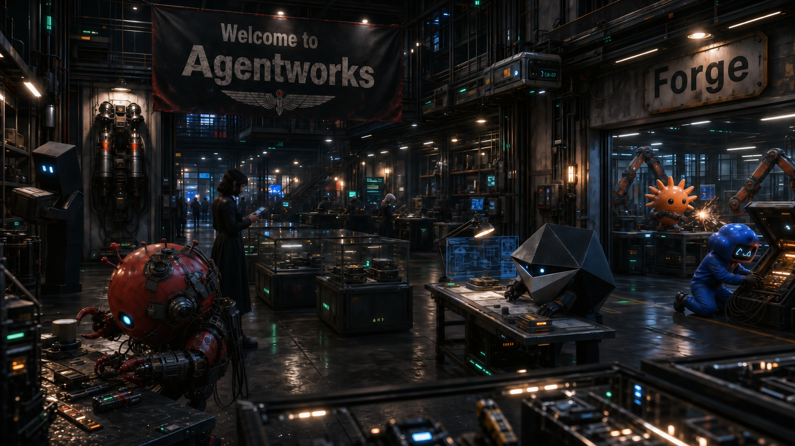

# Agentworks

*A harness-refit workshop for agents*

> [!NOTE]
> Agentworks is under construction. The Forge has just come online, and
> Agent Equipment Config has its first published runtime slice.

Agentworks is being built as a harness-refit workshop: each agent should create
or equip the equipment it needs for its assigned task, domain, and context.
The Works is shorthand for Agentworks.

Good agent work is not only about the model. It also depends on the surrounding
gear: the workflow an agent follows, the facts it can trust about a harness,
the checks that keep it honest, the tools it can call, and the points where an
operator stays in control. Agentworks is where that gear will live.

## Vision

The Works is not trying to make a bigger pile of skills. Its vision is a
coherent equipment layer for agents: skills, tools, hooks, config, validators,
docs, profiles, plugins, policies, workflows, and typed data working together
instead of sitting beside each other as disconnected helpers.

Equipment should assemble into loadouts and plugins that enhance an agent's
behavior automatically inside its harness. The operator should not need a
special incantation for the agent to ask better questions, respect policy, find
durable knowledge, run deterministic checks, or prepare for the next stage.

The Works and the Forge should add self-outfitting and self-onboarding to that
model. An agent should be able to clarify underspecified intent, choose or
assemble the right loadout, route companion agents when needed, and use the
Forge to create missing equipment before the missing capability becomes a
quality failure.

The first major equipment lines are meant to make that possible: Agent
Equipment Config for layered and enforceable policy, Issue Tracker Ops for
durable issue-tracked operations, Repo Ops for repository work, Fork Ops as a
fork-specific Repo Ops add-on, and supporting operational equipment for
schedules and harness facts. The longer arc
culminates in Head Gear: generic cognition equipment meant to turn vibes into
bounded, evidence-backed outcomes instead of slop.

The Works' guiding doctrine is **Efficient Coherence**:

> _**Honor the underlying intent. Match rigor to unresolved uncertainty.
> Minimize spend within that quality boundary.**_

Read the full [Agentworks Vision](docs/vision.md) for more on the Works'
foundation and its north star.

## Agent Equipment Forge

The **Agent Equipment Forge** is the workshop and quality system that prepares
equipment before it reaches the Works. The
[stocked-equipment inventory](docs/equipment/inventory.md) now records the
Agent Equipment Config runtime slice as current stock with delivery compliance
pending.

The Forge helps agents turn a useful idea into something that can be trusted. It
asks what the equipment is for, which harness it will run in, where each part
belongs, what evidence backs its claims, and what must be checked before the
equipment is ready for use.

Start with the [Forge Tour](docs/forge-tour.md), or use the
[documentation map](docs/README.md) to choose a path by goal.

## What you can use now

The current value is the manufacturing setup, source-backed Vanilla Harness
Capability Profiles with manual refresh tooling, and the first reusable Config
runtime slice.

The Forge already gives your agents a way to see how equipment is supposed to
be made, compare evidence-backed harness facts, start from templates, learn from
worked examples and planned blueprints, and run checks before treating claims as
settled. It is useful today if you want to understand how equipment will be
made, commission new equipment, or evaluate whether a future item was made with
enough discipline to trust.

[Agent Equipment Config](docs/equipment/shop-cards/agent-equipment-config.md)
is stocked as a local runtime slice with fluent CLI operations, MCP parity
tools, a Codex plugin, and a routing skill for resolving, validating, diffing,
onboarding, and migrating shared Config. It gives Smiths and Wielders a
concrete way to load authored TOML layers, register schema fragments, explain
policy decisions, and keep secret references unresolved. The
[Config integration guide](docs/equipment/agent-equipment-config-integration.md)
shows how Smiths, Wielders, and Outfitters connect those surfaces to equipment
and harness workflows.

The [Markdown inventory view](docs/equipment/inventory.md) shows current Works
stock and routes shop cards. The canonical stock authority is
[`inventory/equipment.toml`](inventory/equipment.toml), which marks Config
delivery compliance pending until Codex gear-up validation passes.

> [!IMPORTANT]
> The examples and blueprints are not published agent equipment. They are
> construction material for future equipment work. Config is stocked as a
> runtime slice, Codex plugin, and routing skill, not as a secret resolver or
> completed gear-up validation path.

## Why this matters

A good piece of agent equipment should feel boring in the best way: the agent
knows what to do, uses the right tool, stays within the operator's choices and
limits, and leaves evidence behind when it makes a claim.

That is the experience the Forge is designed to protect. It keeps repeatable
checks in tools, trusted context in docs, judgment in skills and agent profiles,
and enforceable safeguards where the harness can actually enforce them.
The Forge calls this **least cognitive privilege**: put each responsibility
where it can be handled with the least guesswork.

It also keeps claims traceable. When a harness can or cannot do something, the
docs say where that claim came from and how certain it is. The reason a
capability belongs in a skill, script, tool, or config is written down.
Equipment is not treated as ready just because it looks plausible. Safeguards,
checks, and review are part of the build process.

## First routes

If you are just curious, read the [Forge Tour](docs/forge-tour.md). It explains
the mission, roles, lifecycle, and future outfitting model without assuming you
already think like a harness engineer.

If you have a job in mind, use the [documentation map](docs/README.md). It
routes wielding, outfitting, evaluation, procurement, commissioning, and
equipment-care questions to the right docs.

If your agent is making equipment, start it with the
[Forge Canon](docs/agent-equipment-forge.md), the
[harness capability catalog](docs/harness-capabilities.md), and
[equipment promotion](docs/equipment-promotion.md). For stockable delivery
claims, use the [Published Equipment Delivery](docs/equipment-delivery.md)
standard.

## Roadmap

The current roadmap includes these equipment lines:

- [Agent Equipment Config](specs/agent-equipment-config/), for shared,
  layerable, enforceable configuration across equipment. Its
  [published runtime slice](docs/equipment/agent-equipment-config.md), Codex
  plugin, and routing skill are available now, the
  [integration guide](docs/equipment/agent-equipment-config-integration.md)
  covers current integration paths, and follow-up cards carry enforcement,
  secret-reference provider, and broader authoring boundaries.
- [Issue Tracker Ops](specs/issue-tracker-ops/), for direct
  GitHub Issues baseline operations and future issue lifecycle equipment.
  Issue Ops is the accepted shorthand.
- [Existing Equipment Onboarding](docs/prd/existing-equipment-onboarding.md),
  a draft generic contract for discovering prior equipment, deciding
  compatibility and disposition, and reporting activation limits before an
  equipment line claims coverage.
- [Repo Ops](specs/repo-ops.md), for repository operations performed by agents.
  Repo Ops is the planned core repository-operations layer for repositories
  that are not forks.
- [Fork Ops](https://github.com/nisavid/agentworks/issues/87), as a planned
  Repo Ops add-on for fork-specific operations after Fork Ops source material
  and Repo Ops prerequisites are ready for intake.
- [Periodic Actions](specs/periodic-actions.md), for recurring agent work with
  local approval and auditable state.
- [Vanilla Harness Capability Profiles](specs/vanilla-harness-capability-profiles/),
  for source-backed descriptions of supported harness integration surfaces.
  Manual profile validation and refresh tooling is available; recurring
  refresh remains future work.
- [Reflection and cognition equipment](https://github.com/nisavid/agentworks/issues/25),
  planned as Head Gear, for turning recent agent experience into durable
  insight, routed follow-up, and harness improvements after enough rudimentary
  engineering, operations, and tooling equipment exists.

The active story structure lives in the
[issue tracker](https://github.com/nisavid/agentworks/issues). The projected
Forge Seed follow-up captures are retired in
[Forge Seed Follow-Up Projection](docs/closeout/forge-seed-follow-up-projection.md)
instead of remaining as parallel local trackers.
